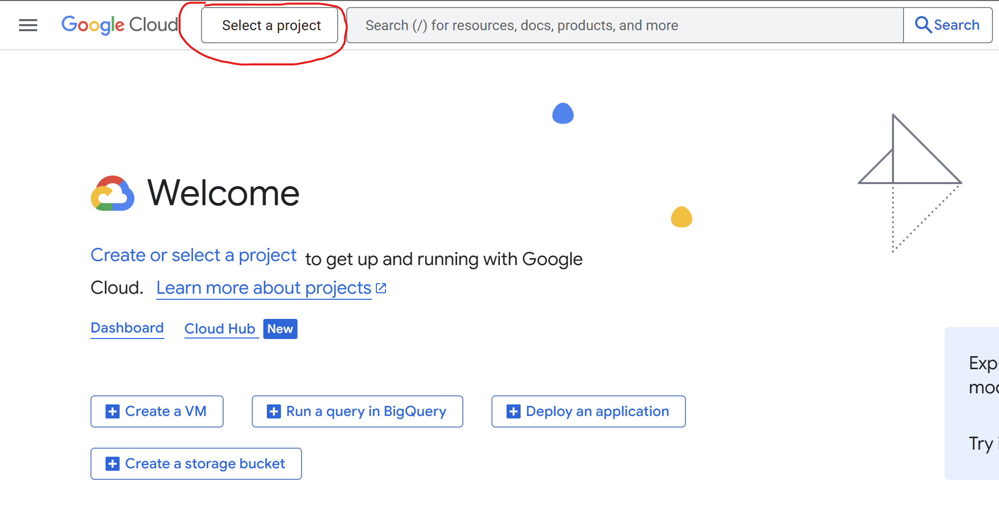
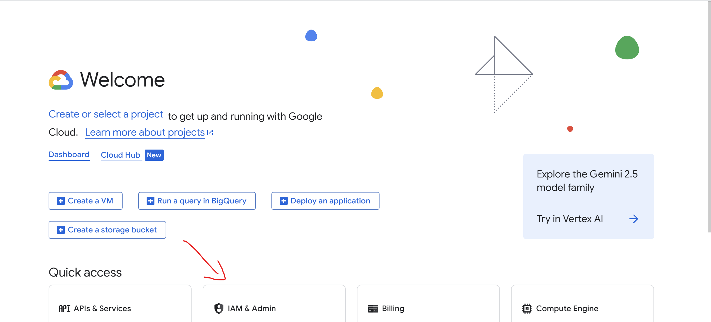
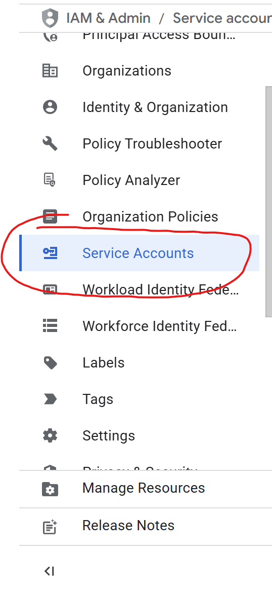
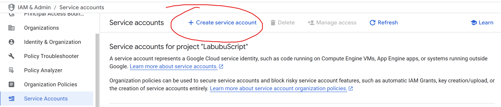
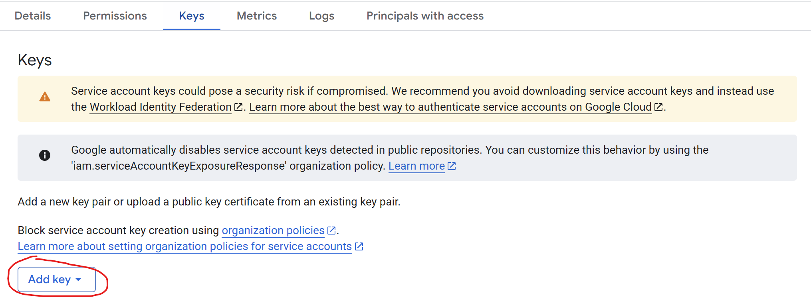
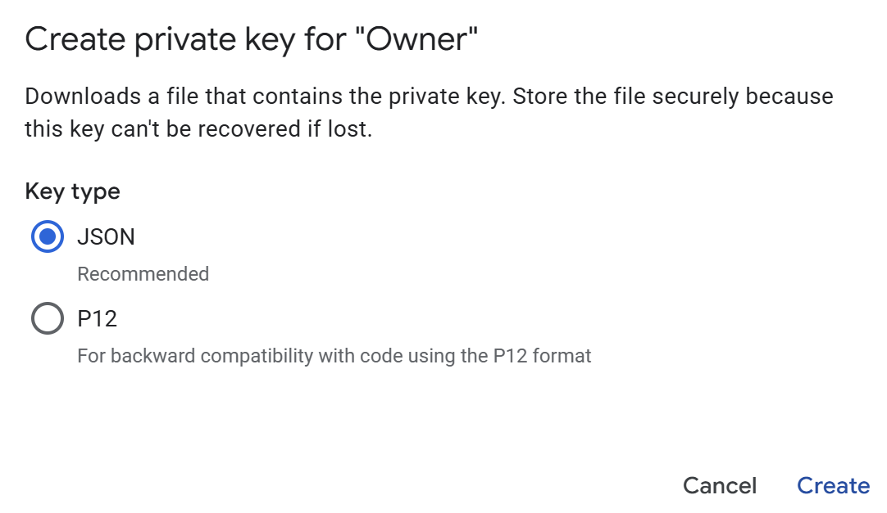
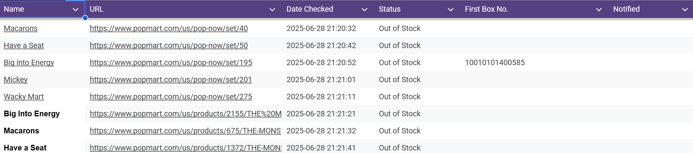

# Popmart Web Scraping Script

Ensure that all libraries needed are installed within your system. Including Selenium, BeautifulSoup4, and Googlesheets API.

First, you must setup and create a google cloud project. No links will be provided. Pictures will be provided as necessary.

Next a service account for the project must be created with owner access. Navigate to **IAM & Admin** and on the leftmost section navigate to **Service Accounts**.

Once created, you will need to create a key. This will be stored in a credentials file within this project that you must make. To do so, stay on the **Service Accounts** section, click on the newly created account, and navigate to **Keys**. Then press Add key and create new existing key. Make sure you press JSON format and store this in your system as you will not be able to get this json file from the back.

Create a google sheet and obtain the ID for the sheets.

Input fields as necessary within the main.py file. Add the email of your service account into the google sheets you are using.

You may Change as needed :smile:

## Setup Example for Google Cloud Projects
### Creating a project

### Create a Service Account for the project

### Create a key for the service account

## Example Google Sheet

## DISCLAIMER
This script no longer works for the popmart site other than to notify when items are back in stock. Changes **CAN** be made in order to change what site this works for as long as adjustments are made to the script itself. This was made to buy items that are commonly very sought after for entertainment purposes **ONLY** and to help others boost their odds at getting these popular items. This is not optimal code and adjustments can be made to make it more optimal as well.

### Potential fixes
There is an issue with the runtime of the code. Because of how it is set up (unorganized and in a very short time span of a day). I rushed to complete it hence there are some optimizations that can be made. EX updates as the script goes rather than when it repeats.